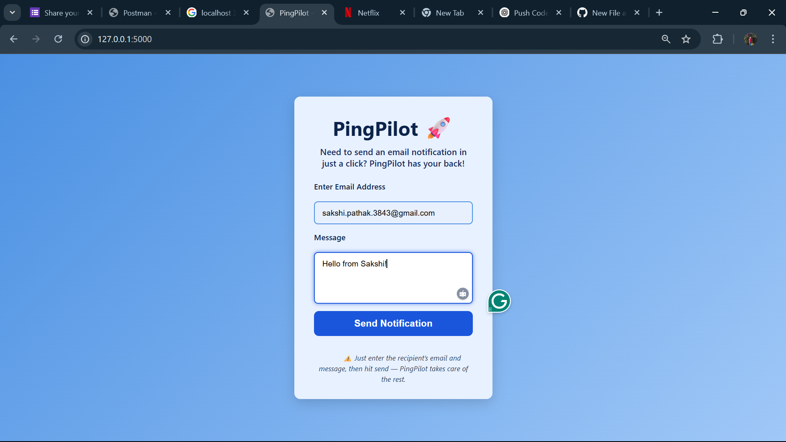
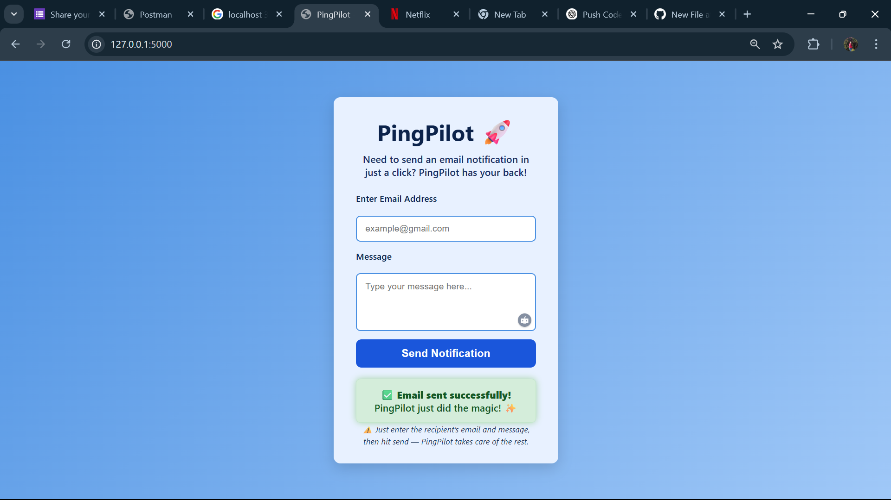

#  PingPilot — A Simple Notification Service

**PingPilot** is a lightweight and easy-to-use notification service app that allows users to **send**, **view**, and **store** simple notifications. Built using the **MERN** approach (MongoDB, Express, Node.js) with a clean vanilla frontend, this app is perfect for understanding the basics of building an end-to-end service with API routing, data persistence, and user interaction.


## 🧠 How It Works (The Logic)

At its core, PingPilot is a simple CRUD app that lets users:
- Fill out a notification form (email + message)
- Submit that data to the backend via a POST request
- Save it in a MongoDB collection
- Retrieve all notifications using a GET request

Here's the flow:

```

User -> HTML Form -> JS Fetch API -> Express Route -> MongoDB

````

- **Frontend** sends a notification via `fetch()` in `script.js`
- **Express Router** (`notificationRoutes.js`) catches the request
- **MongoDB** stores it using Mongoose models
- A success message is sent back and shown to the user

---

## 🔍 Features

- 📨 Send notifications by entering an email and message
- 📜 Retrieve all stored notifications
- 💽 MongoDB for persistent data storage
- 💡 Clean UI with instant feedback
- 📦 RESTful API endpoints

---

## 🖼️ Screenshots

### 📤 Sending a Notification



### 📋 Notification Stored



---

## 🚀 Getting Started

### 📁 Clone the Repo

```bash
git clone https://github.com/sakshepathak/pingpilot.git
cd pingpilot
````

### 🔧 Install Dependencies

```bash
npm install
```

### ⚙️ Set up MongoDB

Make sure you have MongoDB running locally, or replace the URI in `server.js` with your [MongoDB Atlas](https://www.mongodb.com/cloud/atlas) connection string.

```js
mongoose.connect('mongodb://localhost:27017/notificationDB')
```

### ▶️ Start the App

```bash
node server.js
```

Open your browser and go to:
🌐 `http://localhost:3000`

---

## 🔌 API Endpoints

| Method | Endpoint         | Description                  |
| ------ | ---------------- | ---------------------------- |
| GET    | `/notifications` | Get all stored notifications |
| POST   | `/notifications` | Add a new notification       |

You can test them using tools like **Postman** or your frontend form.

---

## 🛠 Folder Structure

```
pingpilot/
├── public/
│   ├── index.html        # Frontend UI
│   ├── script.js         # Fetch API logic
│   └── style.css         # Basic styling
├── routes/
│   ├── userRoutes.js     # (Optional) For user-related logic
│   └── notificationRoutes.js
├── server.js             # Main server file
├── assets/               # Screenshots for README
└── README.md
```

---

## 🧯 Troubleshooting

**❌ MongoDB Connection Error?**

* Ensure MongoDB service is running locally: `mongod`
* If you're using Atlas, check that your URI is correct and IP whitelist is set


**❌ App not loading in browser?**

* Make sure `node server.js` runs without errors
* Visit `http://localhost:3000` and check console logs

---

## 🛠 Technologies Used

* **Frontend**: HTML, CSS, JavaScript (Vanilla)
* **Backend**: Node.js, Express.js
* **Database**: MongoDB
* **Testing Tools**: Postman, Browser Dev Tools

---

## 💡 Future Enhancements

* 🌐 Deploy the app using Render or Vercel
* 🔐 Add JWT-based user authentication
* 📈 Add analytics (e.g., how many notifications sent)
* 📬 Email integration with Nodemailer
* 🧪 Add unit tests using Jest

---

## 🙋🏻‍♀️ Author

Made with 💖 by **Sakshi Pathak**
